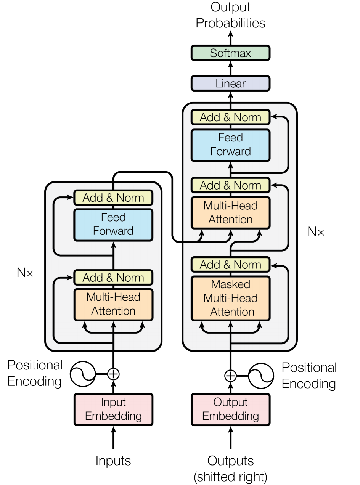

# transformer
基于tensorflow实现的论文[Attention is All You Need](https://arxiv.org/abs/1706.03762)

## 环境配置

### docker cpu镜像

- docker pull majing/tensorflow-1.10.0-cpu-transformer:v1
- docker run -i -t -p 7000:7000 --rm majing/tensorflow-1.10.0-cpu-transformer:v1

### docker gpu镜像

- docker pull majing/tensorflow-1.10.0-gpu-transformer:v1
- docker run -i -t -p 7000:7000 --rm majing/tensorflow-1.10.0-gpu-transformer:v1

### conda环境配置

- python3.6
- pip install -r requirement.txt

## 训练en-zh的模型

### jupyter notebook交互式学习

- 在docker环境下：jupyter-notebook --no-browser --ip 0.0.0.0 --port=7000 --allow-root
- 在浏览器中访问ip:7000打开jupyter

### 预处理、训练、测试命令

- 预处理：python prepro.py
  - github中TED_data为已处理好的数据
- 训练：python train.py
- 测试：python test.py

## 论文概述

### 模型结构

### 计算过程

#### 编码阶段

编码由6个相同的层组成，每一层有两个子层。第一个子层使用了多头的注意力机制，第二个子层是一个基于位置的全连接网络。在两个子层之间使用了残差连接和基于层的参数归一化。也就是说，每一个子层可以用